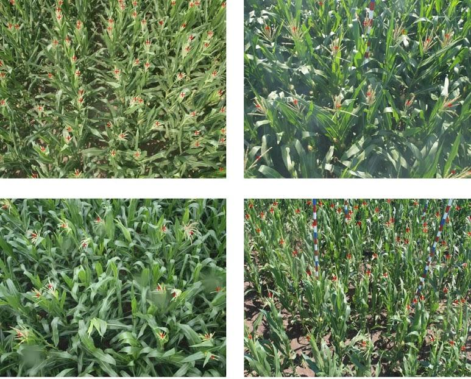

# Maize Tassels Counting Dataset


This repository describes the Maize Tassels Counting (MTC) dataset presented in our work:

**[TasselNet: Counting maize tassels in the wild via local counts regression network](https://plantmethods.biomedcentral.com/track/pdf/10.1186/s13007-017-0224-0)**

[Hao Lu](https://sites.google.com/site/poppinace/)<sup>1</sup>, Zhiguo Cao<sup>1</sup>, Yang Xiao<sup>1</sup>, Bohan Zhuang<sup>2</sup>, [Chunhua Shen](http://cs.adelaide.edu.au/~chhshen/)<sup>2</sup>

<sup>1</sup>Huazhong University of Science and Technology, China

<sup>2</sup>The University of Adelaide, Australia

## Highlights
- 361 field images collected from 4 experimental fields across China: Zhengzhou, Henan Province, China, Taian, Shandong Province, China, Gucheng, Hebei Province, China, and Jalaid, Sinkiang Autonomous Region, China.
- Six cultivars of maize plants: Jundan No.20, Nongda, No.108, Wuyue No.3, Zhengdan No.32, Jidan No.20, and Tianlong No.9.
- Each instance is labeled with dotted annotatations.
- The dataset is full of intrinsic and extrinsic variations, shown below.

## Introduction
We first address plant-related counting problem under unconstrained field conditions. Plant counting is very challenging. What makes plants counting different from other conventional objects, such as crowd, cells and vehicles, is their physical size variations. This attributes to the self-changing nature of plants because they grow over time. The size variations are also nonuniform in images. Maize tassels have almost all necessary characteristics that a typical plant has. We thus collect and annotate the MTC dataset and believe it will be a good study case for in-field plant counting problems.

## Downloads
[Google Drive (1.6GB)](https://drive.google.com/open?id=0B3VP9kTetyv1OXhDdTBwUER2NGM)

* Each image is associated with a standalone ".mat" annotation file that records the position of dots. The ".mat" files are created in Matlab.

## Citation
If you find this dataset useful for your research, please cite:
```
@article{lu2017tasselnet,
  title={TasselNet: counting maize tassels in the wild via local counts regression network},
  author={Lu, Hao and Cao, Zhiguo and Xiao, Yang and Zhuang, Bohan and Shen, Chunhua},
  journal={Plant Methods},
  volume={13},
  number={1},
  pages={79},
  year={2017},
  publisher={BioMed Central}
}
```
